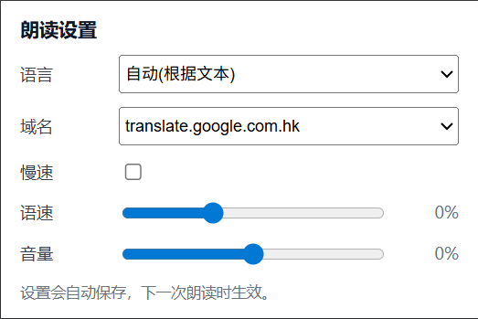

# Web TTS Helper

Web TTS Helper 是一个基于 Chrome/Edge Manifest V3 的轻量扩展：在网页上**选中文本时自动弹出播放按钮**，点击即可通过 gTTS（Google Translate TTS）在线合成并朗读。

## 主要特性

- 一键朗读选区：鼠标或键盘选中任意文本后，在选区右侧出现圆形悬浮按钮（▶）。点击开始朗读；朗读中按钮变为停止（■），再次点击立即停止。
- 自动隐藏，不打扰阅读：无选区/滚动页面/朗读结束后，按钮会在短暂延迟后收起；按钮置于 Shadow DOM 中，避免被页面样式干扰。
- gTTS 在线合成：通过 Google Translate 的 TTS 接口合成 MP3 并播放。
- 自动语言识别：基于 Chrome 语言检测 + 字符集启发式，自动选择合适的 gTTS 语言；也可以在弹出页中手动指定。
- 丰富的语音设置（见上图）：点击工具栏的扩展图标可打开设置页：
  - 语言：支持“自动(根据文本)”或手动选择 gTTS 语言（如 `zh-CN` / `en` / `ja` 等）。
  - 域名：选择 `translate.google.com` / `translate.google.com.hk` / `translate.google.cn`（用于可达性/口音差异）。
  - 慢速：启用 gTTS 慢速模式。
  - 语速 / 音量：通过本地播放速度/增益调整（语速可能影响音高）。
  - 所有设置会自动保存到 `chrome.storage.sync`，下次朗读时直接生效。

## 使用方式

1. 在任意网页选中一段文字（拖拽、双击、Shift+方向键、Ctrl+A 等均可）。
2. 选区附近会出现播放按钮：
   - 点击 ▶ 开始朗读当前选区。
   - 朗读中点击 ■ 立即停止。
3. 如需调整语言/音色/语速等，点击浏览器工具栏上的扩展图标，在弹出页中设置。

## 安装（开发模式加载）

1. 打开 `chrome://extensions`（Edge 同理）。
2. 开启右上角“开发者模式”。
3. 点击“加载未打包的扩展程序”，选择本项目根目录（包含 `manifest.json`）。
4. 刷新任意页面后即可使用。

## 权限说明

- `activeTab`：允许在当前标签页运行内容脚本。
- `storage`：保存并同步语言/域名/语速等个人设置。
- `https://translate.google.*/*`：访问 gTTS（Google Translate）在线合成服务（当前包含 `com` / `com.hk` / `cn`）。

## 注意事项 / 限制

- 需要网络连接才能合成语音；若网络被阻断，可能无法朗读。
- 某些高安全站点、浏览器内置页面或 PDF 可能不允许内容脚本运行。
- 语言检测是启发式的，识别不准时请在弹出页中手动指定语言。
- gTTS 不提供逐词时间戳，高亮为基于播放进度估算，可能与实际朗读略有偏差。
- 过长文本会自动分片发送并连续播放，但极端长选区仍可能有一定延迟。

## 项目结构

- `manifest.json`：扩展配置（MV3）。
- `src/background.js`：gTTS 合成请求（Google Translate batchexecute）与返回 MP3 数据。
- `src/content-script.js`：选区检测、悬浮按钮、gTTS 播放与高亮逻辑。
- `src/popup.html` / `src/popup.js`：工具栏弹出页 UI 与设置持久化（语言/域名/慢速/语速/音量）。
- `icons/`：扩展图标。
